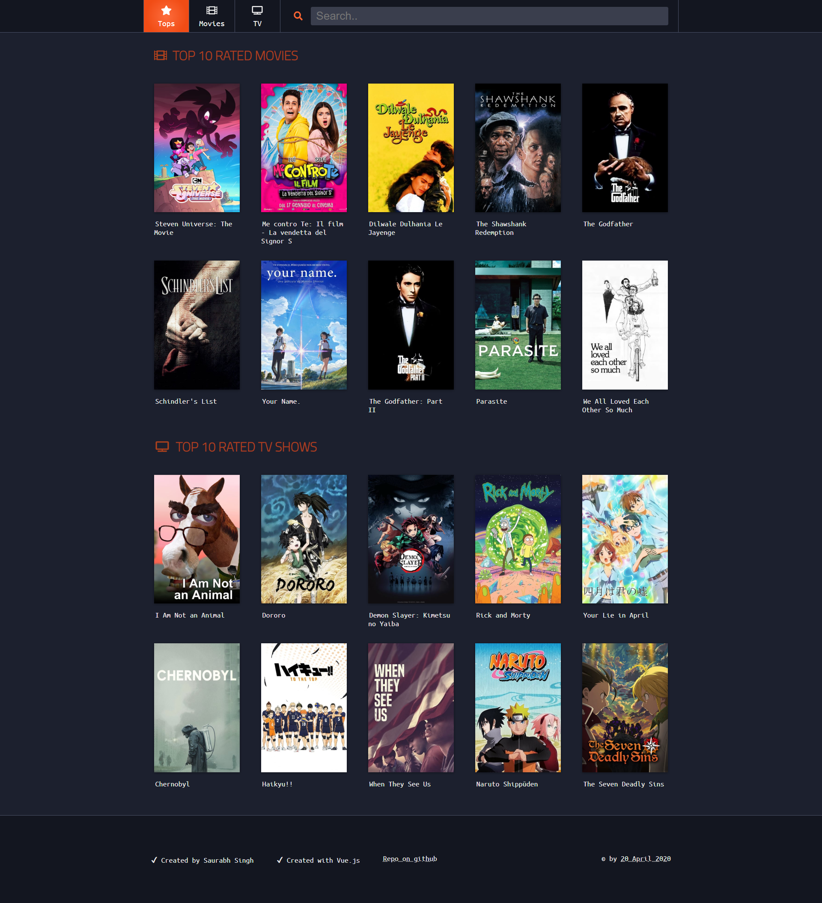
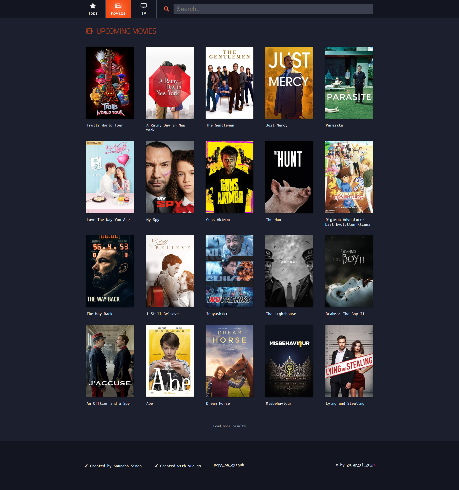
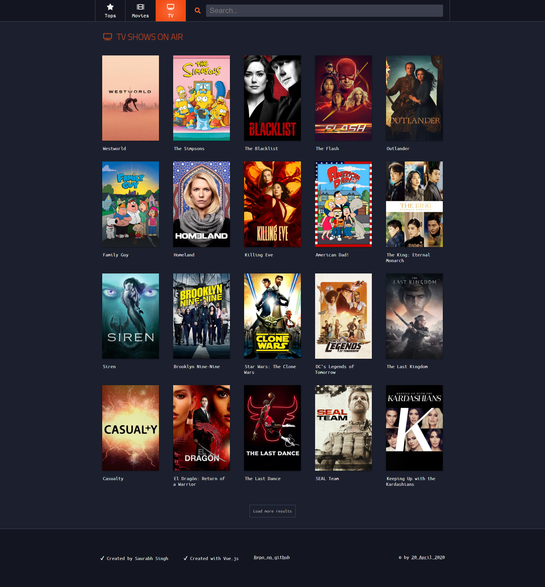

# Mounty-Assignment
#### Create a Vue.js website to display Top Rated Movies and Upcoming Movies consuming The Movie Database APIs.
#### API Guide: https://developers.themoviedb.org/3
#### Top Rated Movies API: https://developers.themoviedb.org/3/movies/get-top-rated-movies
#### Upcoming Movies API: https://developers.themoviedb.org/3/movies/get-upcoming

## Top Movies

## Movies

## TV shows

